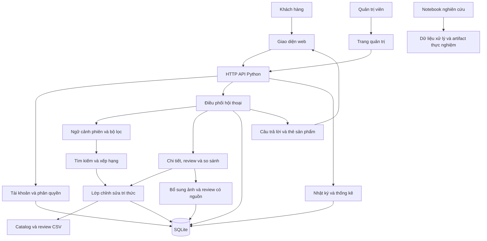

# Chatbot tư vấn mua sắm

Ứng dụng tư vấn mua sắm bằng tiếng Việt, hỗ trợ tìm sản phẩm trên Amazon, Shopee và Tiki, đề xuất tối đa 5 lựa chọn, xem đánh giá và hỏi tiếp theo ngữ cảnh. Dự án gồm ứng dụng web, quản lý tri thức bằng Knowledge Editing và các notebook nghiên cứu hệ thống khuyến nghị.

## Chức năng

| Nhóm | Chức năng hiện có |
| --- | --- |
| Hội thoại | Giữ danh sách vừa đề xuất, tham chiếu sản phẩm theo thứ tự, chọn mẫu phù hợp trong danh sách, giải thích lựa chọn và thay đổi điều kiện ở lượt tiếp theo. |
| Tìm kiếm | Tìm theo mô tả; lọc loại sản phẩm, ngân sách, tiền tệ, thương hiệu, sàn và dung lượng; xử lý yêu cầu loại trừ thương hiệu hoặc sàn. |
| Thông tin sản phẩm | Hiển thị ảnh, giá ghi nhận, thương hiệu, điểm và số lượt đánh giá; xem chi tiết, review, so sánh và sản phẩm tương tự. |
| Tài khoản | Đăng ký, đăng nhập, đăng xuất; lưu lịch sử hội thoại, sản phẩm yêu thích và tùy chọn cá nhân. |
| Quản trị | Tra cứu sản phẩm/review, xem nhật ký xử lý và thống kê hoạt động. |
| Knowledge Editing | Tạo chỉnh sửa có bằng chứng, xem trước kết quả trước/sau, kích hoạt, theo dõi phiên bản và hoàn tác. |
| Bổ sung dữ liệu | Nhập ảnh Amazon theo ASIN, bổ sung ảnh/review Tiki theo mã sản phẩm và nhập giá có nguồn từ CSV. |

## Kiến trúc hệ thống

Sơ đồ mô tả luồng xử lý của ứng dụng đang chạy. Các notebook nghiên cứu được tổ chức riêng để thực nghiệm và đánh giá.



### Mô tả từng thành phần

| Thành phần | Vai trò |
| --- | --- |
| Giao diện khách hàng | Tổ chức các mục Trò chuyện, Tìm sản phẩm, Xem đánh giá và Tài khoản; hiển thị hội thoại, thẻ sản phẩm và nguồn thông tin. |
| HTTP API | Tiếp nhận yêu cầu từ trình duyệt, cung cấp dữ liệu sản phẩm và điều phối chức năng khách hàng/quản trị. |
| Điều phối hội thoại | Xác định thao tác tìm kiếm, xem review, so sánh hoặc chọn trong danh sách sản phẩm của phiên. |
| Ngữ cảnh phiên | Lưu điều kiện tìm kiếm, danh sách vừa xem và sản phẩm đang tham chiếu; cập nhật bộ lọc theo câu hỏi nối tiếp. |
| Tìm kiếm và xếp hạng | Áp dụng bộ lọc trước khi tính điểm và trả tối đa 5 sản phẩm phù hợp theo dữ liệu. |
| Chi tiết và review | Ghép thông tin theo mã sản phẩm, đọc review từ bộ nhớ đệm và chuẩn bị dữ liệu cho câu trả lời. |
| Knowledge Editing | Áp dụng chỉnh sửa đang kích hoạt khi truy xuất; lưu bằng chứng, phiên bản và sự kiện thay đổi. |
| Tài khoản | Băm mật khẩu có salt, quản lý phiên đăng nhập và kiểm tra quyền truy cập lịch sử, hồ sơ, yêu thích. |
| Bổ sung dữ liệu | Lấy ảnh/review theo định danh sản phẩm, lưu nguồn và thời điểm; hỗ trợ nhập giá có nguồn. |
| SQLite | Lưu trạng thái ứng dụng, tài khoản, hội thoại, chỉnh sửa, nhật ký và bộ nhớ đệm. |
| Notebook nghiên cứu | Thực nghiệm chuẩn bị dữ liệu, embeddings, FAISS/RAG, collaborative filtering, BPR, khuyến nghị kết hợp, LLM và Knowledge Editing. |

## Cách chạy app

### 1. Chuẩn bị

- Python **3.10 trở lên**.
- Đặt `products.csv` và `reviews.csv` trong `research/data/` theo [hướng dẫn dữ liệu](research/data/README.md).
- Backend dùng thư viện chuẩn Python. Tiện ích nhập ảnh và kiểm thử trình duyệt có phụ thuộc riêng được hướng dẫn bên dưới.

Tải mã nguồn:

```powershell
git clone https://github.com/TranQuangTrieu11/KLTN.git
cd KLTN
```

### 2. Chạy trên máy cá nhân

Trên Windows, mở `start_local.bat`, hoặc chạy:

```powershell
python agent_server.py
```

Truy cập **http://127.0.0.1:8781/**. Chờ nạp dữ liệu hoàn tất trước khi tìm kiếm. Lần đầu hệ thống chuẩn bị bộ nhớ đệm review; những lần sau sử dụng dữ liệu đã lưu.

Khi chạy từ terminal, nhấn **Ctrl+C** để dừng. Nhấn **Ctrl+F5** trong trình duyệt để tải lại giao diện sau khi cập nhật mã nguồn.

### 3. Chạy trong mạng LAN

Mở `start_lan.bat`, hoặc cấu hình:

```powershell
$env:AGENT_HOST = '0.0.0.0'
$env:AGENT_PORT = '8781'
python agent_server.py
```

Thiết bị cùng mạng truy cập `http://<IP-máy-chạy-app>:8781/`. Cho phép cổng tương ứng qua tường lửa khi cần. Mỗi cổng sử dụng một tiến trình server.

### 4. Mở trang quản trị

Đặt token trước khi khởi động server:

```powershell
$env:AGENT_ADMIN_TOKEN = 'thay-bang-token-rieng'
python agent_server.py
```

Mở **http://127.0.0.1:8781/admin.html**, nhập cùng token rồi tải dữ liệu.

## Hướng dẫn sử dụng app

### Trò chuyện và tìm sản phẩm

1. Mở **Trò chuyện**, nhập nhu cầu, ví dụ: “Thẻ nhớ microSD 64GB dưới 20 USD”.
2. Xem tối đa 5 sản phẩm kèm giá, ảnh và đánh giá.
3. Hỏi tiếp: “Sản phẩm nào tốt nhất trong 5 cái bạn vừa gửi?”, “Vì sao bạn chọn nó?” hoặc “Review sản phẩm số 2”.
4. Điều chỉnh nhu cầu: “Còn loại 128GB”, “Dưới 30 USD” hoặc “Không lấy hãng Kingston”.
5. Yêu cầu “So sánh 1 và 2” để đối chiếu các mẫu trong danh sách.

**Enter** gửi câu hỏi; **Shift+Enter** xuống dòng. Mỗi phiên giữ ngữ cảnh riêng.

### Chi tiết, review và sản phẩm tương tự

- Bấm **Chi tiết và đánh giá** để xem thông tin cùng review theo mã sản phẩm.
- Bấm **Sản phẩm tương tự** để tìm lựa chọn cùng nhóm, có xét điều kiện tìm kiếm hiện tại.
- Dùng **Tìm sản phẩm** để tra cứu độc lập và **Xem đánh giá** để tìm sản phẩm cần đọc review.
- Mở phần nguồn thông tin để đối chiếu dữ liệu được sử dụng trong câu trả lời.

### Tài khoản và yêu thích

Mở **Tài khoản**, đăng ký bằng email và mật khẩu ít nhất 10 ký tự. Sau khi đăng nhập, có thể lưu sản phẩm yêu thích, xem lịch sử, chọn phiên trò chuyện và cập nhật hồ sơ/tùy chọn cá nhân. Đăng xuất khi kết thúc trên thiết bị dùng chung.

### Chỉnh sửa tri thức

Trong trang quản trị, chọn sản phẩm và trường cần cập nhật, nhập giá trị mới, lý do và nguồn bằng chứng. Xem trước câu trả lời trước/sau, sau đó kích hoạt chỉnh sửa. Có thể theo dõi phiên bản và hoàn tác.

Ví dụ thực hành: dùng dữ liệu giả lập để đổi giá từ `16.99 USD` thành `15.99 USD`, xem trước thay đổi rồi kích hoạt. Ghi rõ bằng chứng là **dữ liệu giả lập**. Chỉnh sửa được lưu riêng và áp dụng khi truy xuất.

## Cấu trúc dự án

```text
index.html                  Trang khách hàng
admin.html                  Trang quản trị
app.css / app.js            Giao diện và thao tác khách hàng
agent_server.py             HTTP server, tìm kiếm và đọc dữ liệu
agent_extensions.py         Ngữ cảnh, hội thoại, chỉnh sửa và thống kê
conversation_context.py     Xử lý câu hỏi nối tiếp và thay bộ lọc
customer_accounts.py        Tài khoản, hồ sơ và yêu thích
product_enrichment.py       Bổ sung ảnh/review có nguồn
import_amazon_images.py     Nhập ảnh Amazon theo ASIN
import_product_prices.py    Nhập giá có nguồn từ CSV
agent_learning_rules.json   Quy tắc nhận biết nhóm sản phẩm
agent_state.sqlite3         Tài khoản, hội thoại, chỉnh sửa và cache
chat_history.json           Lịch sử cũ được giữ để tham khảo
research/data/              Dataset và artifact thí nghiệm
research/notebooks/         Các notebook của đề tài
PROJECT_NOTES.md            Ghi chú quá trình phát triển
test_agent_extensions.py    Kiểm thử backend
test_browser_smoke.py       Kiểm tra thao tác trên trình duyệt
start_local.bat             Chạy trên máy cá nhân
start_lan.bat               Chạy để test trong mạng LAN
.runtime/                   Log và ảnh kiểm tra tạm
```

`agent_state.sqlite3`, `chat_history.json`, dataset và file tạm được quản lý tại máy chạy. Sao lưu `agent_state.sqlite3` cùng `research/data/` để giữ trạng thái và dữ liệu dự án.

## Dữ liệu và tiện ích

Catalog gồm **164.926 sản phẩm**: 121.917 Amazon, 41.575 Tiki và 1.434 Shopee. Ảnh Amazon được ghép theo ASIN từ metadata nguồn; lần nhập trên máy phát triển ghi nhận **121.902 sản phẩm có ảnh**. Ảnh/review Tiki được bổ sung theo mã sản phẩm và lưu nguồn cùng thời điểm truy xuất.

### Nhập ảnh Amazon

Tiện ích đọc cột ASIN và ảnh từ metadata Amazon Reviews 2023 qua HTTP range. Chuẩn bị catalog, cài phụ thuộc rồi chạy:

```powershell
python -m pip install pyarrow
python import_amazon_images.py B0C1H1Q3C1 B07LG5WBTS
python import_amazon_images.py --all
```

### Nhập giá có nguồn

Chuẩn bị CSV gồm `product_id,price,currency,source_url,recorded_at`. Mã sản phẩm khớp catalog, giá dương, tiền tệ USD/VND, nguồn là URL và thời điểm theo ISO 8601 có múi giờ.

```powershell
python import_product_prices.py prices.csv --check
python import_product_prices.py prices.csv
```

Giá được lưu thành các phiên bản Knowledge Editing có bằng chứng. Việc nhập thực hiện trong một giao dịch để bảo đảm tính nhất quán khi có xung đột.

## Kiểm thử

Chạy kiểm thử backend:

```powershell
python -m unittest -v test_agent_extensions.py
```

Bộ kiểm thử sử dụng dữ liệu giả lập và SQLite tạm, bao gồm phân quyền, bộ lọc, top 5, sản phẩm tương tự, ngữ cảnh, review cache, xử lý lỗi và Knowledge Editing.

Kiểm thử trình duyệt dùng `test_browser_smoke.py`, cần gói `websocket-client`, app ở cổng 8781 và trình duyệt có CDP ở cổng 9223:

```powershell
python -m pip install websocket-client
python test_browser_smoke.py
```

## Hạn chế

- Kết quả tư vấn phụ thuộc phạm vi, chất lượng và thời điểm ghi nhận của dữ liệu; giá hiển thị được hiểu theo nguồn và thời điểm tương ứng.
- Khả năng giữ ngữ cảnh tập trung vào các dạng câu hỏi mua sắm được xử lý và kiểm thử. Với yêu cầu phức tạp, diễn đạt rõ loại sản phẩm và điều kiện giúp tăng độ chính xác.
- Mức độ đầy đủ của ảnh và review phụ thuộc nguồn dữ liệu cùng khả năng truy cập dịch vụ bên ngoài.
- Ứng dụng phục vụ nghiên cứu và thử nghiệm; các notebook là môi trường thực nghiệm riêng. Kiểm thử chức năng được sử dụng cùng đánh giá chất lượng khuyến nghị và câu trả lời khi đánh giá toàn bộ đề tài.
